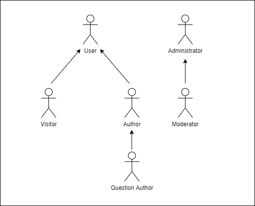
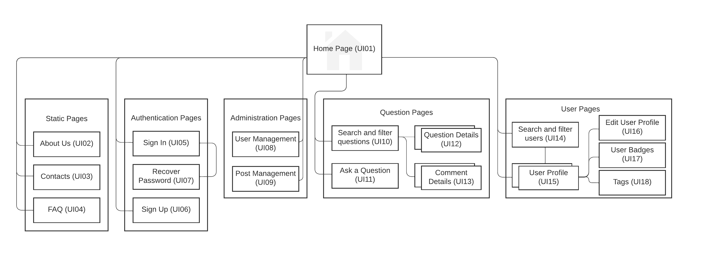
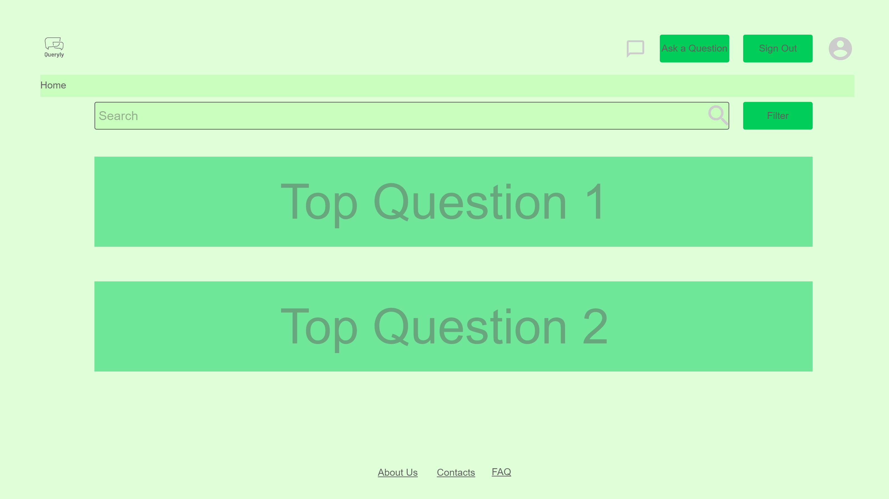
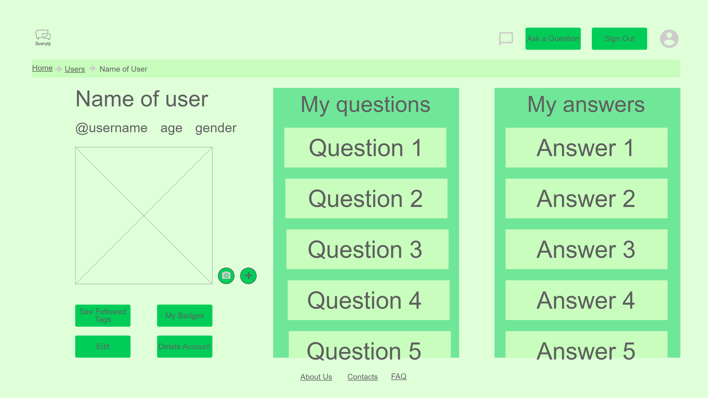
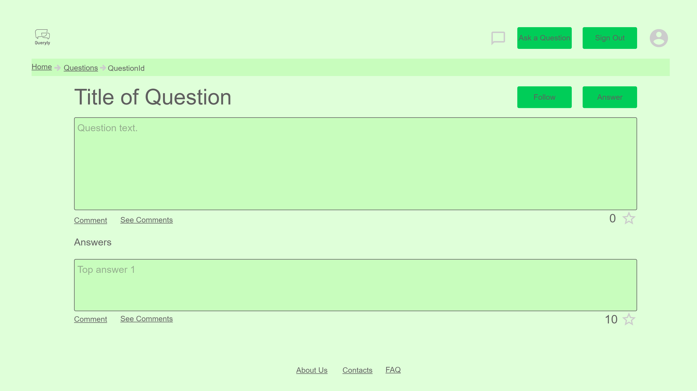
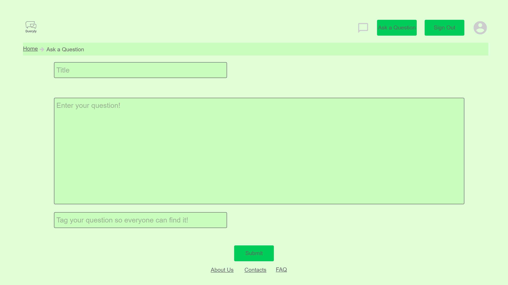
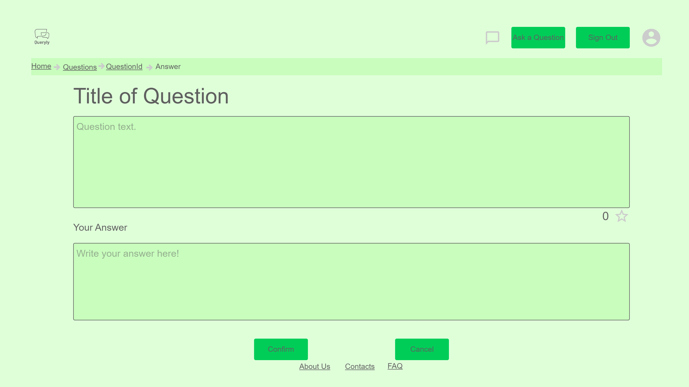

# ER: Requirements Specification Component
> For everyone from all generations that needs help to find the solution to their problem, Queryly is a web-based system that allows you to post all your questions that need an answer, and/or post answers to help other users find the way to the solution of their problem. Unlike other services, our product is a safe space for all users no matter race, gender, sexuality, or age. Queryly is designed to be a helpful system for anyone that decides to join our community.

---

## A1: Queryly

The main goal of Queryly is the development of a web-based system that promotes interaction between users, in order for them to help each other out with any questions. This is a tool that can be used by anyone, anywhere in the world, be it a student who wants help with a math problem, or an old lady wanting to know where to buy the best wool in the area.  This idea was born from our desire to have a place where we could just ask any questions, without feeling judged, and to receive a myriad of answers so that we are able to choose the solution that best fits our situation.

This application allows users to post questions on the website, and answer other users’ questions. They can find questions to be answered by browsing the website or just going to the home page, where the top questions are displayed.

Users are separated into groups with different permissions. These groups include the administrator and moderators, with complete access, modification privileges, and content management, and the registered users, with permissions to view and edit their profile, make, edit and delete questions, answers, and comments, and have a personal feed that has content that the user is interested in, view their own questions and answers, vote and follow question and answers, and receive notifications about answers and votes to my content. Authenticated users are identified as authors because all registered users can post questions, answers, and/or comments, but when posting a question, the user is identified as the question author so that they can manage the content of their own post and tag an answer as correct if any. There are also unregistered users that have access to the static pages, which contain information about the website and its creators, the sign in page, which they can use to sign in to the website after they have created an account, and the sign up page, which they can use to create an account, the feed where they can choose to see the top or recent questions, other users profile pages, where they can find more information about the user, and they can also browse the website to find questions to answer/read either by text or tags and view details about questions. The moderators manage the content - they can remove content if it violates website rules. The administrator has all the privileges, having all features registered and unregistered users have, and the ability to manage content like moderators. The feature that identifies this user as an administrator is the privilege to manage tags, thus being able to add, edit or remove tags that users can use to categorize their posts. After installation, a team of moderators is defined by the administrator, which will be responsible for managing the system, and ensuring it runs smoothly.

The platform will have an adaptive design, allowing users to have a pleasant experience regardless of their device. The product will also allow for easy user navigation and an overall pleasant experience.

---

## A2: Actors and User stories
> This artifact describes the actors that the system uses and their user stories. An actor is the 'owner' of a user story, and a user story tells a short story about that actor using the product. This artifact also describes business rules, technical requirements, and restrictions that the system should have.

### 1. Actors

| Actor | Description |
| ----- | ----------- |
| **User** | Generic user that has access to public information, such as questions posted by other users. |
| **Visitor** | Unauthenticated user that can register itself (sign-up) or sign-in in the system. |
| **Author** | Authenticated user that can insert questions and comments and edit/delete questions and comments posted by themselves. |
| **Question Author** | Authenticated user that can edit question tags for a post of their own and mark answers as correct to that post. |
| **Moderator** | Authenticated user that can delete content from other users and edit question tags for a post. |
| **Administrator** | Authenticated user that has privileges over other users and can manage tags for posts. |

### 2. User Stories
The user stories present in this section are ordered by the most generic actor to the most specific actor, thus allowing better visualization of all the features that each actor has. All actors benefit from user stories described by actors before them.

#### 2.1 **User**
| Identifier | Name | Priority | Description |
| ---------- | ---- | -------- | ----------- |
| US01 | View Top Questions | high | **As a** *User*,   **I want to** view the top questions of the website,   **so that** I can see the content that other users interact with more. |
| US02 | Browse Questions | high | **As a** *User*,   **I want to** browse questions,   **so that** I can browse for questions that I’m more interested in. |
| US03 | Exact Match Search | high | **As a** *User*,   **I want to** type in something on the search bar,   **so that** the search result matches the precise keywords in the prescribed order. |
| US04 | Full-text Search | high | **As a** *User*,   **I want to** to type in something on the search bar,   **so that** the search results contain at least one match to the search parameters. |
| US05 | View Recent Questions | medium | **As a** *User*,   **I want to** view recent questions posted on the website,   **so that** I can see the recent content that other users are posting. |
| US06 | Browse Questions by Tags | medium | **As a** *User*,   **I want to** browse questions by tags,   **so that** I can browse for questions by the topics that I’m most interested in. |
| US07 | View Question Details | medium | **As a** *User*,   **I want to** view question details,   **so that** I can see more information about the question that I’m reading. |
| US08 | View User Profiles | medium | **As a** *User*,   **I want to** view user profiles,   **so that** I can see information about another user and what posts were made by them. |
| US09 | Search over Multiple Attributes | medium | **As a** *User*,   **I want to** to select any number of attributes,   **so that** the results respect all the selected fields. |
| US10 | Search Filters | medium | **As a** *User*,   **I want to** filter my search,   **so that** the search results contain the content that I'm looking for. |
| US11 | See Home | medium | **As a** *User*,   **I want to** access the home page,   **so that** I can see a brief presentation of the website. |
| US12 | See About | medium | **As a** *User*,   **I want to** access the about page,   **so that** I can see a complete description of the website and its creators. |
| US13 | See Contacts | medium | **As a** *User*,   **I want to** access contacts,   **so that** I can come in touch with the platform creators. |
| US14 | See FAQ | medium | **As a** *User*,   **I want to** access the FAQ,   **so that** I can get quick answers to common questions. |
| US15 | Order Results | low | **As a** *User*,   **I want to** order the search results,   **so that** I can find what I'm looking for faster. |

#### 2.2 **Visitor**
| Identifier | Name | Priority | Description |
| ---------- | ---- | -------- | ----------- |
| US16 | Sign in | high | **As a** *Visitor*,   **I want to** authenticate into the system,   **so that** I can access privileged information.
| US17 | Sign up | high | **As a** *Visitor*,   **I want to** register myself into the system,   **so that** I can authenticate myself into the system. |
| US18 | Recover Password | medium | **As a** *Visitor*,   **I want to** prove my identity within the system and ask for new credentials,   **so that** I can log in to my account again. |

#### 2.3 **Author**
| Identifier | Name | Priority | Description |
| ---------- | ---- | -------- | ----------- |
| US19 | Log out | high | **As an** *Author*,   **I want to** terminate my authentication to the system,   **so that** no one has access to my account on that machine. |
| US20 | View Own Profile | high | **As an** *Author*,   **I want to** view my own profile,   **so that** I can see my personal information. |
| US21 | Edit Own Profile | high | **As an** *Author*,   **I want to** edit my own profile,   **so that** I can update my personal information. |
| US22 | View Personal Feed | high | **As an** *Author*,   **I want to** view a personal feed,   **so that** I see content on my feed that I’m interested in. |
| US23 | Post Question | high | **As an** *Author*,   **I want to** post a question,   **so that** another user can help me find the solution. |
| US24 | Post Answer | high | **As an** *Author*,   **I want to** post an answer,   **so that** I can help another user find the solution to their question. |
| US25 | View My Questions | high | **As an** *Author*,   **I want to** view my questions,   **so that** I can see all the questions that I made and access them more easily. |
| US26 | View My Answers | high | **As an** *Author*,   **I want to** view my answers,   **so that** I can see all the answers that I gave and access them more easily. |
| US27 | Edit My Question | high | **As an** *Author*,   **I want to** edit my question,   **so that** I can add/update/remove content of the question. |
| US28 | Delete My Question | high | **As an** *Author*,   **I want to** delete my question,   **so that** I can remove my question from the website. |
| US29 | Edit My Answer | high | **As an** *Author*,   **I want to** edit my answer,   **so that** I can add/update/remove content of the answer. |
| US30 | Delete My Answer | high | **As an** *Author*,   **I want to** delete my answer,   **so that** I can remove my answer from the website. |
| US31 | Delete My Account | medium | **As an** *Author*,   **I want to** delete my account,   **so that** my information is deleted from the website. |
| US32 | Support Profile Picture | medium | **As an** *Author*,   **I want to** select a profile picture,   **so that** it displays in the platform. |
| US33 | Vote on Questions | medium | **As an** *Author*,   **I want to** vote on questions,   **so that** other users know that the question was good. |
| US34 | Vote on Answers | medium | **As an** *Author*,   **I want to** vote on answers,   **so that** other users know that the answer was good. |
| US35 | Comment on Questions | medium | **As an** *Author*,   **I want to** comment on questions,   **so that** I can ask the authors of the questions more information or add a question related to it. |
| US36 | Comment on Answers | medium | **As an** *Author*,   **I want to** comment on answers,   **so that** I can complete an answer written by another user or add a related question/more information to it. |
| US37 | Follow Question | medium | **As an** *Author*,   **I want to** follow questions,   **so that** I can get updates to questions more easily. |
| US38 | Follow Tags | medium | **As an** *Author*,   **I want to** follow tags,   **so that** I can see questions about the topics that I’m interested in more easily. |
| US39 | Edit My Comment | medium | **As an** *Author*,   **I want to** edit my comment,   **so that** I can add/update/remove content of the comment. |
| US40 | Delete My Comment | medium | **As an** *Author*,   **I want to** delete my comment,   **so that** I can remove my comment from the website. |
| US41 | View Personal Notifications | medium | **As an** *Author*,   **I want to** view my personal notifications,   **so that** I can stay updated on interactions of other users to my content. |
| US42 | Receive Notification of Answer to Question | medium | **As an** *Author*,   **I want to** receive notifications of answers to my question,   **so that** I can stay updated if a user posted the solution to my question. |
| US43 | Receive Notification of Vote on Content | medium | **As an** *Author*,   **I want to** receive notifications of votes on my content,   **so that** I know if my content was helpful to other users. |
| US44 | Report Content | low | **As an** *Author*,   **I want to** report content,   **so that** the website stays free of offensive or not suitable content. |
| US45 | Support User Badges | low | **As an** *Author*,   **I want to** support user badges,   **so that** I can acknowledge the participation of another user. |
| US46 | Badge Award | low | **As an** *Author*,   **I want to** have a badge award,   **so that** I can know that my participation was meaningful to other users. |

#### 2.4 **Question Author**
| Identifier | Name | Priority | Description |
| ---------- | ---- | -------- | ----------- |
| US47 | Edit Question Tags | medium | **As a** *Question Author*,   **I want to** edit question tags,   **so that** I can update the topics that my question is about. |
| US48 | Mark Answer as Correct | medium | **As a** *Question Author*,   **I want to** mark an answer as correct,   **so that** I can show other users the solution that worked for my question. |

#### 2.5 **Moderator**
| Identifier | Name | Priority | Description |
| ---------- | ---- | -------- | ----------- |
| US49 | Delete Content | medium | **As a** *Moderator*,   **I want to** delete content,   **so that** I can remove content from the website that may be offensive or not suitable. |
| US50 | Edit Question Tags | medium | **As a** *Moderator*,   **I want to** edit question tags,   **so that** the tags of the question are more suitable for the content that it has. |
| US51 | Manage Content Reports | low | **As a** *Moderator*,   **I want to** manage content reports,   **so that** I can check if the content is being reasonably reported. |

#### 2.6 **Administrator** 
| Identifier | Name | Priority | Description |
| ---------- | ---- | -------- | ----------- |
| US52 | Administrate User Accounts | high | **As an** *Administrator*,   **I want to** administrate user accounts,   **so that** I have the highest level of access to make changes in an account. |
| US53 | Manage Tags | medium | **As an** *Administrator*,   **I want to** manage tags,   **so that** users can choose the tags more appropriated to their questions. |
| US54 | Administrator Accounts | medium | **As an** *Administrator*,   **I want to** be an administrator account,   **so that** I can make changes that require special permissions. |
| US55 | Block/Unblock User Accounts | medium | **As an** *Administrator*,   **I want to** block and unblock user accounts,   **so that** I can keep the website free of offensive users. |
| US56 | Delete User Account | medium | **As an** *Administrator*,   **I want to** delete user accounts,   **so that** I can delete information of a user from the website. |

### 3. Supplementary Requirements
Supplementary requirements are all types of constraints and qualities related to the system as a whole and not only to individual functions. Business rules define conditions for the product that is being developed. Technical requirements are the factors required to deliver a function or behavior that the system must meet to satisfy a user's standards and needs.

#### 3.1. **Business Rules**
| Identifier | Name | Description |
| ---------- | ---- | ----------- |
| BR01 | Delete Account | Upon account deletion (USxy), shared user data (questions, answers, and comments) is kept but is made anonymous. |
| BR02 | Administrator Account | Administrators are participating community members, i.e. can post or vote on questions or answers. |
| BR03 | Edit Content | Questions and answers edited after being posted should have a clear indication of the editions. |
| BR04 | Badges | User badges are dependent on the likes and dislikes received on his questions and answers, and also on actions made by the user (first question, first answers, etc). |
| BR05 | Interact with own content | An Author can answer, comment, and vote on their own question. |
| BR06 | Follow Own Question | An Author can not follow their own question. |
| BR07 | Self Badge | An Author can’t badge themselves. |

#### 3.2. **Technical Requirements**
| Identifier | Name | Description |
| ---------- | ---- | ----------- |
| TR01 | Performance | The system should have response times shorter than 2s to ensure the user's attention. |
| TR02 | Robustness | The system must be prepared to handle and continue operating when runtime errors occur. |
| TR03 | Scalability | The system must be prepared to deal with the growth in the number of users and their actions. |
| TR04 | Accessibility | The system must ensure that everyone can access the pages, regardless of whether they have any handicaps or not, or the Web browser they use. |

#### 3.3. **Restrictions**
| Identifier | Name | Description |
| ---------- | ---- | ----------- |
| R01 | Deadline | The system should be ready to be used at the beginning of the next year. |

---

## A3: Information Architecture
> This artifact presents an overview of the information architecture to be used in the developed system. It helps identify and describe user requirements, raise new ones, and allows to preview and empirically test the user interface (UI). It also enables quick and multiple iterations on the design of the UI.

### 1. Sitemap
Queryly's system is divided into five main areas: the Static Pages, which provide information about the system; the Authentication Pages, which allow an unauthenticated user to sign in or sign up; the Administration Pages, which include the administration features; the Question Pages, which group all the pages used to explore and view questions, answers and comments; and the User Pages, which allow an user to view their page, and the page of others.

### 2. Wireframes
A wireframe is a two-dimensional illustration of a page's interface that specifically focuses on space allocation and prioritization of content, functionalities available, and intended behaviors.

#### Wireframe 1: Home Page

#### Wireframe 2: User Profile

#### Wireframe 3: Question Page

#### Wireframe 4: Add a Question Page

#### Wireframe 5: Add an Answer Page

---

## Revision History
- Corrected US numbers for Administrator

---

GROUP2294, 02/10/2022

- Ana Sofia Teixeira, [up201906031@fc.up.pt](mailto:up201906031@fc.up.pt) (editor)
- Gabriel Alves, [up201709532@fc.up.pt](mailto:up201709532@fc.up.pt)
- Guilherme Bica, [up201705374@fc.up.pt](mailto:up201705374@fc.up.pt)
- Margarida Nazaré, [up201908209@fc.up.pt](mailto:up201908209@fc.up.pt) (editor)