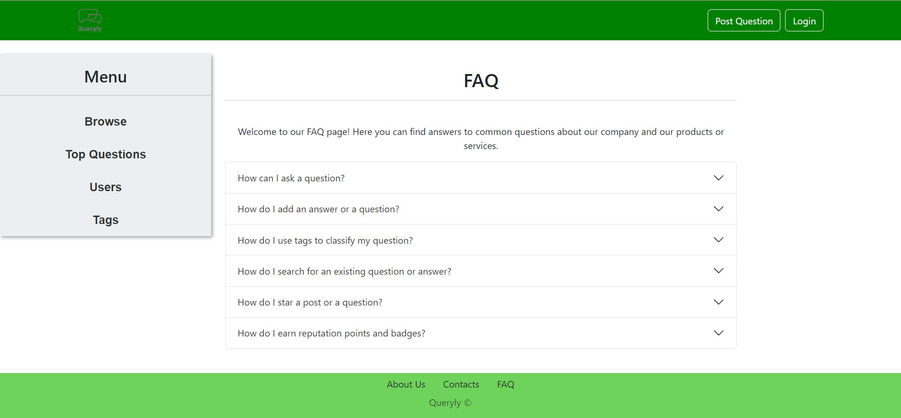
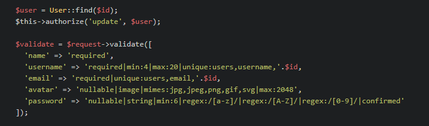
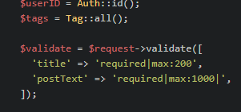
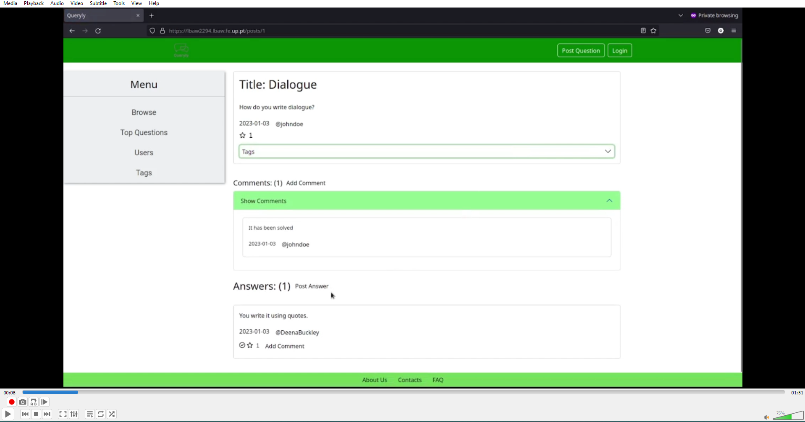

# PA: Product and Presentation
> For everyone from all generations that needs help to find the solution to their problem, Queryly is a web-based system that allows you to post all your questions that need an answer, and/or post answers to help other users find the way to the solution of their problem. Unlike other services, our product is a safe space for all users no matter race, gender, sexuality, or age. Queryly is designed to be a helpful system for anyone that decides to join our community.

## A9: Product
> Queryly is a web-based system that allows users to ask and answer questions. Users can be grouped into administrators, moderators, and registered or unregistered users. Administrators and moderators have more control over the content on the site, while registered users can create and edit their own questions, answers, and comments. Unregistered users can browse the site and view questions and answers, but cannot post content. The website also has static pages with information about the website and its creators, as well as a sign in and sign up page for creating an account. Moderators are responsible for managing the site and ensuring it runs smoothly, while the administrator has the additional ability to manage tags.

### 1. Installation

You can find the final version of the source code [here](https://git.fe.up.pt/lbaw/lbaw2223/lbaw2294/-/tree/main/).

```shell
docker run -p 80:80 --name=lbaw2294 git.fe.up.pt:5050/lbaw/lbaw2223/lbaw2294
```

### 2. Usage

URL to the product: http://lbaw2294.lbaw.fe.up.pt  

#### 2.1. Administration Credentials

Administration URL: http://lbaw2294.lbaw.fe.up.pt/users/1

| Email                | Password |
| -------------------- | -------- |
| admin@example.com    | 1234     |

#### 2.2. User Credentials

To more easily test our product's functionality, the user passwords found in the database are 1234. However, when a new user wants to register, this password will not work as we have password requirements that need to be accepted.

Here are some examples of the types of accounts that we have implemented:

| Type          | Username                  | Password |
| ------------- | ------------------------- | -------- |
| Basic Account | jonah_kaufman@example.com | 1234     |
| Moderator     | anaya_salas@example.com   | 1234     |

### 3. Application Help

We used the Frequently Asked Questions page to address any questions the users may have about the usage of the website.



### 4. Input Validation

Input was validated in the Controllers methods.

For example, in User Controller when we want to update a user profile:



Or when we want to post a question:



### 5. Check Accessibility and Usability

We followed the Accessibility and Usability checklist and obtained the following output:

- [Accessibility](https://git.fe.up.pt/lbaw/lbaw2223/lbaw2294/-/blob/main/docs/AccessibilityChecklist.pdf)
- [Usability](https://git.fe.up.pt/lbaw/lbaw2223/lbaw2294/-/blob/main/docs/UsabilityChecklist.pdf)

### 6. HTML & CSS Validation

We validated the HTML and CSS code of the product pages and saved the output of the validation in a folder [docs](https://git.fe.up.pt/lbaw/lbaw2223/lbaw2294/-/tree/main/docs) available at the repository.

For the HTML validation, we validated the following pages:
- [Homepage](https://git.fe.up.pt/lbaw/lbaw2223/lbaw2294/-/blob/main/docs/HTMLValidator/Homepage.pdf)
- [About Page](https://git.fe.up.pt/lbaw/lbaw2223/lbaw2294/-/blob/main/docs/HTMLValidator/AboutPage.pdf)
- [Add Tags Page](https://git.fe.up.pt/lbaw/lbaw2223/lbaw2294/-/blob/main/docs/HTMLValidator/AddTagsPage.pdf)
- [Blocked Users Page](https://git.fe.up.pt/lbaw/lbaw2223/lbaw2294/-/blob/main/docs/HTMLValidator/BlockedUsersPage.pdf)
- [Contacts Page](https://git.fe.up.pt/lbaw/lbaw2223/lbaw2294/-/blob/main/docs/HTMLValidator/ContactsPage.pdf)
- [Edit Answer Page](https://git.fe.up.pt/lbaw/lbaw2223/lbaw2294/-/blob/main/docs/HTMLValidator/EditAnswerPage.pdf)
- [Edit Comment Page](https://git.fe.up.pt/lbaw/lbaw2223/lbaw2294/-/blob/main/docs/HTMLValidator/EditCommentPage.pdf)
- [Edit Profile Page](https://git.fe.up.pt/lbaw/lbaw2223/lbaw2294/-/blob/main/docs/HTMLValidator/EditProfilePage.pdf)
- [Edit Question Page](https://git.fe.up.pt/lbaw/lbaw2223/lbaw2294/-/blob/main/docs/HTMLValidator/EditQuestionPage.pdf)
- [Edit Question Tags Page](https://git.fe.up.pt/lbaw/lbaw2223/lbaw2294/-/blob/main/docs/HTMLValidator/EditQuestionTagsPage.pdf)
- [FAQs Page](https://git.fe.up.pt/lbaw/lbaw2223/lbaw2294/-/blob/main/docs/HTMLValidator/FAQsPage.pdf)
- [Login Page](https://git.fe.up.pt/lbaw/lbaw2223/lbaw2294/-/blob/main/docs/HTMLValidator/LoginPage.pdf)
- [Manage Reports Page](https://git.fe.up.pt/lbaw/lbaw2223/lbaw2294/-/blob/main/docs/HTMLValidator/ManageReportsPage.pdf)
- [Messages Page](https://git.fe.up.pt/lbaw/lbaw2223/lbaw2294/-/blob/main/docs/HTMLValidator/MessagesPage.pdf)
- [Post Answer Page](https://git.fe.up.pt/lbaw/lbaw2223/lbaw2294/-/blob/main/docs/HTMLValidator/PostAnswerPage.pdf)
- [Post Comment Page](https://git.fe.up.pt/lbaw/lbaw2223/lbaw2294/-/blob/main/docs/HTMLValidator/PostCommentPage.pdf)
- [Post Question Page](https://git.fe.up.pt/lbaw/lbaw2223/lbaw2294/-/blob/main/docs/HTMLValidator/PostQuestionPage.pdf)
- [Question Page](https://git.fe.up.pt/lbaw/lbaw2223/lbaw2294/-/blob/main/docs/HTMLValidator/QuestionPage.pdf)
- [Recover Password Page](https://git.fe.up.pt/lbaw/lbaw2223/lbaw2294/-/blob/main/docs/HTMLValidator/RecoverPasswordPage.pdf)
- [Register Page](https://git.fe.up.pt/lbaw/lbaw2223/lbaw2294/-/blob/main/docs/HTMLValidator/RegisterPage.pdf)
- [Remove Tags Page](https://git.fe.up.pt/lbaw/lbaw2223/lbaw2294/-/blob/main/docs/HTMLValidator/RemoveTagsPage.pdf)
- [Search Page](https://git.fe.up.pt/lbaw/lbaw2223/lbaw2294/-/blob/main/docs/HTMLValidator/SearchPage.pdf)
- [Tags Page](https://git.fe.up.pt/lbaw/lbaw2223/lbaw2294/-/blob/main/docs/HTMLValidator/TagsPage.pdf)
- [Top Questions Page](https://git.fe.up.pt/lbaw/lbaw2223/lbaw2294/-/blob/main/docs/HTMLValidator/TopQuestionsPage.pdf)
- [Update Followed Tags Page](https://git.fe.up.pt/lbaw/lbaw2223/lbaw2294/-/blob/main/docs/HTMLValidator/UpdateFollowedTagsPage.pdf)
- [User Answers Page](https://git.fe.up.pt/lbaw/lbaw2223/lbaw2294/-/blob/main/docs/HTMLValidator/UserAnswersPage.pdf)
- [User Badges Page](https://git.fe.up.pt/lbaw/lbaw2223/lbaw2294/-/blob/main/docs/HTMLValidator/UserBadgesPage.pdf)
- [User Followed Tags Page](https://git.fe.up.pt/lbaw/lbaw2223/lbaw2294/-/blob/main/docs/HTMLValidator/UserFollowedTagsPage.pdf)
- [User Page](https://git.fe.up.pt/lbaw/lbaw2223/lbaw2294/-/blob/main/docs/HTMLValidator/UserPage.pdf)
- [User Questions Page](https://git.fe.up.pt/lbaw/lbaw2223/lbaw2294/-/blob/main/docs/HTMLValidator/UserQuestionsPage.pdf)
- [Users Page](https://git.fe.up.pt/lbaw/lbaw2223/lbaw2294/-/blob/main/docs/HTMLValidator/UsersPage.pdf)

For the CSS validation, we have the following file:
- [CSS Validation](https://git.fe.up.pt/lbaw/lbaw2223/lbaw2294/-/blob/main/docs/CSSValidation.pdf)

### 7. Revisions to the Project

During the development of the project, we found the need to update previous components, such as the database.

#### Database
We added new tables and updated some tables to have more attributes. These changes can be seen at the [database.sql](https://git.fe.up.pt/lbaw/lbaw2223/lbaw2294/-/blob/main/resources/sql/database.sql) file. The [ebd](ebd) page was also updated with the new information.

### 8. Web Resources Specification

This section contains the updated version of the OpenAPI Specification used for this project.
It can be found [here](https://git.fe.up.pt/lbaw/lbaw2223/lbaw2294/-/blob/dev/a9_openapi.yml?plain=0).


```yaml
openapi: 3.0.0

info:
 version: '1.0'
 title: 'Queryly Web API'
 description: 'Web Resources Specification (A7) for Queryly'

servers:
- url: https://lbaw2294.lbaw.fe.up.pt/
  description: Production server

externalDocs:
 description: Find more info here.
 url: https://git.fe.up.pt/lbaw/lbaw2223/lbaw2294/-/wikis/home

tags:
 - name: 'M01: Authentication'
 - name: 'M02: Individual Profile'
 - name: 'M03: Posts'
 - name: 'M04: Comments'
 - name: 'M05: User Administration'
 - name: 'M06: Post Administration'
 - name: 'M07: Comment Administration'
 - name: 'M08: Static Pages'
 - name: 'M09: Users'
 - name: 'M10: Tags'

paths:
# authentication
 /login:
   get:
     operationId: R101
     summary: 'R101: Login Form'
     description: 'Provide login form. Access: PUB'
     tags:
       - 'M01: Authentication'
     responses:
       '200':
         description: 'Ok. Show Log-in UI'
   post:
     operationId: R102
     summary: 'R102: Login Action'
     description: 'Processes the login form submission. Access: PUB'
     tags:
       - 'M01: Authentication'

     requestBody:
       required: true
       content:
         application/x-www-form-urlencoded:
           schema:
             type: object
             properties:
               email:          # <!--- form field name
                 type: string
               password:    # <!--- form field name
                 type: string
             required:
                  - email
                  - password

     responses:
       '302':
         description: 'Redirect after processing the login credentials.'
         headers:
           Location:
             schema:
               type: string
             examples:
               302Success:
                 description: 'Successful authentication. Redirect to user profile.'
                 value: '/users/{id}'
               302Error:
                 description: 'Failed authentication. Redirect to login form.'
                 value: '/login'

 /logout:

   post:
     operationId: R103
     summary: 'R103: Logout Action'
     description: 'Logout the current authenticated user. Access: USR, ADM'
     tags:
       - 'M01: Authentication'
     responses:
       '302':
         description: 'Redirect after processing logout.'
         headers:
           Location:
             schema:
               type: string
             examples:
               302Success:
                 description: 'Successful logout. Redirect to login form.'
                 value: '/'

 /register:
   get:
     operationId: R104
     summary: 'R104: Register Form'
     description: 'Provide new user registration form. Access: PUB'
     tags:
       - 'M01: Authentication'
     responses:
       '200':
         description: 'Ok. Show Sign-Up UI'

   post:
     operationId: R105
     summary: 'R105: Register Action'
     description: 'Processes the new user registration form submission. Access: PUB'
     tags:
       - 'M01: Authentication'

     requestBody:
       required: true
       content:
         application/x-www-form-urlencoded:
           schema:
             type: object
             properties:
               name:
                 type: string
               email:
                 type: string
               username:
                 type: string
               password:
                 type: string
               birthday:
                 type: string
                 format: date
                 description: 'Birthday of user'
                 example: '30-01-2022'
             required:
                - name
                - email
                - username
                - password
                - birthday

     responses:
       '302':
         description: 'Redirect after processing the new user information.'
         headers:
           Location:
             schema:
               type: string
             examples:
               302Success:
                 description: 'Successful authentication. Redirect to user profile.'
                 value: '/users/{id}'
               302Failure:
                 description: 'Failed authentication. Redirect to login form.'
                 value: '/register'

 /recoverpassword:
   get:
     operationId: R106
     summary: 'R106: Recover Password Form'
     description: 'Form for recovering password. Access: PUB'
     tags:
       - 'M01: Authentication'
     responses:
       '200':
         description: 'Show recover password UI.'
   post:
     operationId: R107
     summary: 'R107: Recover Password Action'
     description: 'Process recovering password form. Access: PUB'
     tags:
       - 'M01: Authentication'
     requestBody:
       required: true
       content:
         application/x-www-form-urlencoded:
           schema:
             type: object
             properties:
               email:
                 type: string
             required:
                - email
     responses:
       '302':
         description: 'Redirect to email sent page.'

 /newpassword/{token}:
   get:
     operationId: R108
     summary: 'R108: New Password after recover email Form'
     description: 'Form for defining new password after receiving recover email. Access: PUB'
     tags:
       - 'M01: Authentication'
     parameters:
       - in: path
         name: token
         schema:
           type: string
         required: true
     responses: 
       '200':
         description: 'Show New Password UI.'

 /newpassword:
   /post:
     operationId: R109
     summary: 'R109: New Password after recover email Action'
     description: 'Processes new password request. Access: PUB'
     tags:
       - 'M01: Authentication'
     requestBody:
       required: true
       content:
         application/x-www-form-urlencoded:
           schema:
             type: object
             properties:
               email:
                 type: string
               password:
                 type: string
             required:
                - email
                - password
     responses:
       '302':
         description: 'Redirect to login page.'

# users
 /users/{id}:
   get:
     operationId: R201
     summary: 'R201: View user profile'
     description: 'Show the individual user profile. Access: PUB'
     tags:
       - 'M02: Individual Profile'

     parameters:
       - in: path
         name: id
         schema:
           type: integer
         required: true

     responses:
       '200':
         description: 'Ok. Show User Profile UI'

 /users/{id}/edit:
   get:
     operationId: R202
     summary: 'R202: Show edit user form'
     description: 'Show the individual user profile editing page. Access: OWR'
     tags:
       - 'M02: Individual Profile'

     parameters:
       - in: path
         name: id
         schema:
           type: integer
         required: true

     responses:
       '200':
         description: 'Ok. Show User Profile Edit UI'
   patch:
    operationId: R203
    summary: 'R203: Process show edit user form'
    description: 'Process the individual user profile editing information. Access: OWR'
    tags:
      - 'M02: Individual Profile'
    parameters:
       - in: path
         name: id
         schema:
           type: integer
         required: true
    responses:
      '302':
        description: 'Redirect after processing the edit information back to the user page.'
        headers:
          Location:
            schema:
              type: string

 /users/{id}/questions:
   get:
     operationId: R204
     summary: 'R204: View user own questions'
     description: 'Show the individual user questions. Access: PUB'
     tags:
       - 'M02: Individual Profile'

     parameters:
       - in: path
         name: id
         schema:
           type: integer
         required: true

     responses:
       '200':
         description: 'Ok. Show User Questions UI'
         
 /users/{id}/answers:
   get:
     operationId: R205
     summary: 'R205: View user own answers'
     description: 'Show the individual user answers. Access: PUB'
     tags:
       - 'M02: Individual Profile'

     parameters:
       - in: path
         name: id
         schema:
           type: integer
         required: true

     responses:
       '200':
         description: 'Ok. Show User Answers UI'

 /users/{id}:
  post:
    operationId: R206
    summary: 'R206: Delete User Account'
    description: 'Delete the account. Access: OWN, ADM'
    tags:
      - 'M02: Individual Profile'
    parameters:
      - in: path
        name: id
        schema:
          type: integer
        required: true
    responses:
      '302':
        description: 'Ok. Show login UI if user deleted is the authenticated else show user search page.'

 /users/blocked:
   get:
     operationId: R207
     summary: 'R207: See Blocked Users'
     description: 'Show blocked user accounts. Access: ADM'
     tags:
       - 'M05: User Administration'
     responses:
       '200':
         description: 'Ok. Show blocked users administration page.'
   patch:
     operationId: R208
     summary: 'R208: Block a user'
     description: 'Block a user from accessing their account. Access: ADM'
     tags:
       - 'M05: User Administration'
     responses:
       '302':
         descripion: 'Reload page.'

 /users/messages:
   get:
     operationId: R209
     summary: 'R209: See messages sent through contacts page'
     description: 'Show messages sent from contacts page. Access: ADM'
     tags:
       - 'MO5: User Administration'
     responses:
       '200':
         description: 'Ok. Show messages UI.'
   patch:
     operationId: R210
     summary: 'R210: Delete message'
     description: 'Delete a message that has been sent through contacts page. Access: ADM'
     tags:
       - 'M05: User Administration'
     responses:
       '302':
         description: 'Ok. Reload messages page.'

 /users/{id}/badges:
   get:
     operationId: R211
     summary: 'R211: View user badges'
     description: 'Show badges user owns. Access: PUB'
     tags:
       - 'M02: Individual Profile'
     parameters:
       - in: path
         name: id
         schema:
           type: integer
         required: true
     responses:
       '200':
         description: 'Ok. Show badges UI.'
 
 /users/{id}/tags:
   get:
     operationId: R212
     summary: 'R212: View followed tags'
     description: 'Show tags user follows. Access: PUB'
     tags:
       - 'M02: Individual Profile'
     parameters:
       - in: path
         name: id
         schema:
           type: integer
         required: true
     responses:
       '200':
         description: 'Ok. Show followed tags UI.'

 /users/{id}/tags/update:
   get:
     operationId: R213
     summary: 'R213: Show update followed tags page.'
     description: 'Show update followed tags page. Access: USR'
     tags: 
       - 'M02: Individual Profile'
     parameters:
       - in: path
         name: id
         schema:
           type: integer
         required: true
     responses:
       '200':
         description: 'Ok. Show update followed tags UI.'
   patch:
     operationId: R214
     summary: 'R214: Update followed tags.'
     description: 'Update followed tags action. Access: OWN'
     tags:
       - 'M02: Individual Profile'
     parameters:
       - in: path
         name: id
         schema:
           type: integer
         required: true
     responses:
       '302':
         description: 'Redirect to followed tags page.'

 /users/{id}/manageReports:
   get:
     operationId: R215
     summary: 'R215: Manage posts and comments reports page'
     description: 'Page for seeing posts and comments reports. Access: ADM'
     tags:
       - 'M06: Post Administration'
       - 'M07: Comment Administration'
     parameters:
       - in: path
         name: id
         schema:
           type: integer
         required: true
     responses:
       '200':
         description: 'Ok. Show manage reports UI.'

 /users:
   get:
     operationId: R216
     summary: 'R216: User search page'
     description: 'Page for user search. Access: PUB'
     tags:
       - 'M09: Users'
     responses:
       '200':
         description: 'Ok. Show search UI.'

 /resultsUsers:
   post:
     operationId: R217
     summary: 'R217: Search for users'
     description: 'Search for users action. Access: PUB'
     tags:
       - 'M09: Users'
     requestBody:
       required: true
       content:
         application/x-www-form-urlencoded:
           schema:
             type: object
             properties:
               search:
                type: string
     responses:
       '302':
         description: 'Redirect to search results.'

# posts         
 /posts/{id}:
   get:
     operationId: R301
     summary: 'R301: View post'
     description: 'Show the post. Access: PUB'
     tags:
       - 'M03: Posts'
     parameters:
       - in: path
         name: id
         schema:
           type: integer
         required: true
     responses:
       '200':
         description: 'Ok. Show Post UI'
   post:
     operationId: R302
     summary: 'R302: Report post'
     description: 'Report post. Access: USR'
     tags:
       - 'M03: Posts' 
     parameters:
       - in: path
         name: id
         schema:
           type: integer
         required: true
     responses:
       '302':
         description: 'Redirect to question page.'
   patch:
     operationId: R303
     summary: 'R303: Follow question'
     description: 'Follow question. Access: USR'
     tags:
      - 'M03: Posts'
     responses:
      '302':
         description: 'Reload page.'
  
 /posts/questions/new:
   get:
    operationId: R304
    summary: 'R304: Add Question Form'
    description: 'Provide new question form. Access: USR'
    tags:
      - 'M03: Posts'

    parameters:
      - in: path
        name: userId
        schema:
          type: integer
        required: true
    
    responses:
       '200':
         description: 'Ok. Show Add Question UI'
    
   post:
    operationId: R305
    summary: 'R305: Add Question Action'
    description: 'Processes the new question form submission. Access: USR'
    tags:
      - 'M03: Posts'

    requestBody:
      required: true
      content:
        application/x-www-form-urlencoded:
          schema:
            type: object
            properties:
              title:
                type: string
              postText:
                type: string
            required:
               - title
               - postText

    responses:
      '302':
        description: 'Redirect after processing the new question information.'
        headers:
          Location:
            schema:
              type: string

 /posts/answers/new:
   get:
    operationId: R306
    summary: 'R306: Add Answer Form'
    description: 'Provide new answer form. Access: USR'
    tags:
      - 'M03: Posts'

    parameters:
      - in: path
        name: userId
        schema:
          type: integer
        required: true
      - in: path
        name: postId
        schema:
          type: integer
        required: true
    
    responses:
       '200':
         description: 'Ok. Show Add Answer UI'
    
   post:
    operationId: R307
    summary: 'R307: Add Answer Action'
    description: 'Processes the new answer form submission. Access: USR'
    tags:
      - 'M03: Posts'

    requestBody:
      required: true
      content:
        application/x-www-form-urlencoded:
          schema:
            type: object
            properties:
              postText:
                type: string
            required:
               - postText

    responses:
      '302':
        description: 'Redirect after processing the new answer information.'
        headers:
          Location:
            schema:
              type: string
 
 /posts/{id}/edit:
   get:
    operationId: R308
    summary: 'R308: Edit Post Form'
    description: 'Provide edit post form. Access: OWR'
    tags:
      - 'M03: Posts'

    parameters:
      - in: query
        name: title
        schema:
          type: integer
        required: false
      - in: query
        name: postText
        schema:
          type: integer
        required: false
    
    responses:
       '200':
         description: 'Ok. Show Edit Post UI'

   patch:
    operationId: R309
    summary: 'R309: Edit Post Action'
    description: 'Provide edit post form. Access: OWR'
    tags:
      - 'M03: Posts'
    
    parameters:
      - in: query
        name: postText
        schema:
          type: integer
        required: false
    
    responses:
      '302':
        description: 'Redirect after processing edit post information.'
        headers:
          Location:
            schema:
              type: string

 /homepage:
  get:
    operationId: R310
    summary: 'R310: Show homepage'
    description: 'Show all posts indiscriminately. Access: PUB'
    tags:
      - 'M03: Posts'
    responses:
       '200':
         description: 'Ok. Show HomePage UI'

 /resultsPosts:
  post:
    operationId: R311
    summary: 'R311: Show search results'
    description: 'Processes the search and displays the results. Access: PUB'
    tags:
      - 'M03: Posts'
    requestBody:
      required: true
      content:
        application/x-www-form-urlencoded:
          schema:
            type: object
            properties:
              search:
                type: string
              tags:
                type: string
              orderby:
                type: string
            required:
               - orderby
    responses:
      '302':
        description: 'Redirect after processing the search.'
        headers:
          Location:
            schema:
              type: string
              
 /posts/{id}/delete:
   post:
     operationId: R312
     summary: 'R312: Delete a post'
     description: 'Delete a post. Access: OWR, MOD, ADM'
     tags:
       - 'M03: Posts'

     parameters:
       - in: path
         name: id
         schema:
           type: integer
         required: true
         
     responses:
       '302':
         description: 'Ok. If post is question go back to search, if is answer reload parent post.'

 /api/star/{userId}/{postId}:
   get:
     operationId: R313
     summary: 'R313: Show star'
     description: 'Show if star is active in a post. Access: PUB'
     tags:
       - 'M03: Posts'

     parameters:
       - in: path
         name: userId
         schema:
           type: integer
         required: true
       - in: path
         name: postId
         schema:
           type: integer
         required: true
     
     responses:
       '200':
         description: 'Ok. Show Post UI'
         
   put:
     operationId: R314
     summary: 'R314: Like a post API'
     description: 'Put a star in a post. Access: USR'
     tags:
       - 'M03: Posts'

     parameters:
       - in: path
         name: userId
         schema:
           type: integer
         required: true
       - in: path
         name: postId
         schema:
           type: integer
         required: true
         
     responses:
       '302':
         description: 'Ok. Show Post UI'
         
   delete:
     operationId: R315
     summary: 'R315: Unlike a post API'
     description: 'Delete star in a post. Access: USR'
     tags:
       - 'M03: Posts'

     parameters:
       - in: path
         name: userId
         schema:
           type: integer
         required: true
       - in: path
         name: postId
         schema:
           type: integer
         required: true
         
     responses:
       '302':
         description: 'Ok. Show Post UI'

 /posts/{id}/edittags:
   get:
     operationId: R316
     summary: 'R316: Edit tags Form'
     description: 'Show form for editing tags on question. Access: OWN, MOD, ADM'
     tags:
       - 'M03: Posts'
     parameters:
       - in: path
         name: id
         schema:
           type: integer
         required: true
     responses:
       '200':
         description: 'Ok. Show edit tags on question UI.'
   patch:
     operationId: R317
     summary: 'R317: Edit tags action'
     description: 'Edit tags on question. Access: OWN, MOD, ADM'
     tags:
       - 'M03: Posts'
     parameters:
       - in: path
         name: id
         schema:
           type: integer
         required: true
     responses:
       '302':
         description: 'Redirect to question page.'

 /posts/topquestions:
   get:
    operationId: R318
    summary: 'R318: Show top questions'
    description: 'Show 10 top questions ordered by like count. Access: PUB'
    tags:
       - 'M03: Posts'
    responses:
       '200':
         description: 'Ok. Show top questions UI.'

# comments
 /comments/{id}:
   patch:
     operationId: R401
     summary: 'R401: Delete comment'
     description: 'Delete the comment. Access: OWN, MOD, ADM'
     tags:
       - 'M04: Comments'
       - 'M07: Comment Administration'
     parameters:
       - in: path
         name: id
         schema:
           type: integer
         required: true
     responses:
       '302':
         description: 'Redirect to question page.'
   post:
     operationId: R402
     summary: 'R402: Report comment'
     description: 'Report the comment. Access: USR'
     tags:
       - 'M04: Comments'
     parameters:
       - in: path
         name: id
         schema:
           type: integer
         required: true
     responses:
       '302':
         description: 'Reload page.'

 /posts/{postid}/comments/new:
   get:
     operationId: R403
     summary: 'R403: Show new comment form'
     description: 'Show new comment form. Access: USR'
     tags:
       - 'M04: Comments'
     parameters:
       - in: path
         name: postid
         schema:
           type: integer
         required: true
     responses:
       '200':
         description: 'Ok. Show new comment UI.'
   post:
     operationId: R404
     summary: 'R404: New comment action'
     description: 'Post new comment. Access: USR'
     tags:
       - 'M04: Comments'
     parameters:
       - in: path
         name: postid
         schema:
           type: integer
         required: true
     requestBody:
       required: true
       content:
         application/x-www-form-urlencoded:
           schema:
             type: object
             properties:
               commenttext:
                 type: string
             required:
                - commenttext
     responses:
       '302':
         description: 'Redirect to question page.'

 /posts/{id}/comments:
   get:
     operationId: R405
     summary: 'R405: Show comments for post'
     description: 'Show comments for a post. Access: PUB'
     tags:
       - 'M03: Posts'
       - 'M04: Comments'
     parameters:
       - in: path
         name: id
         schema:
           type: integer
         required: true
     responses:
       '200':
         description: 'Ok. Show comments for post.'

 /comments/{commentid}/edit:
   get:
     operationId: R405
     summary: 'R405: Update Comment Form'
     description: 'Show update comment form. Access: OWN, MOD, ADM'
     tags:
       - 'M04: Comments'
       - 'M07: Comment Administration'
     parameters:
       - in: path
         name: commentid
         schema:
           type: integer
         required: true
     responses:
       '200':
         description: 'Ok. Show Edit Comment UI.'
   patch:
     operationId: R406
     summary: 'R406: Update Comment Action'
     description: 'Update Comment. Access: OWN, MOD, ADM'
     tags:
       - 'M04: Comments'
       - 'M07: Comment Administration'
     parameters:
       - in: path
         name: commentid
         schema:
           type: integer
         required: true
     requestBody:
       required: true
       content:
         application/x-www-form-urlencoded:
           schema:
             type: object
             properties:
               commenttext:
                 type: string
             required:
                - commenttext
     responses:
       '302':
         description: 'Redirect to question page.'

# static     
 /about:
   get:
     operationId: R801
     summary: 'R801: View about page'
     description: 'Show the about page. Access: PUB'
     tags:
       - 'M08: Static Pages'
       
     responses:
       '200':
         description: 'Ok. Show About UI'

 /contacts:
   get:
     operationId: R802
     summary: 'R802: View contacts page'
     description: 'Show the contacts page. Access: PUB'
     tags:
       - 'M08: Static Pages'
       
     responses:
       '200':
         description: 'Ok. Show Contacts UI'
  
 /faq:
   get:
     operationId: R803
     summary: 'R803: View faqs page'
     description: 'Show the faqs page. Access: PUB'
     tags:
       - 'M08: Static Pages'
       
     responses:
       '200':
         description: 'Ok. Show FAQs UI'

# tags
 /tags:
   get:
     operationId: R1001
     summary: 'R1001: Show all tags page'
     description: 'Shows all tags, number of followers per tag, how many posts use a tag, and, if authenticated, if user follows each tag. Access: PUB'
     tags:
       - 'M10: Tags'
     responses:
       '200':
         description: 'Ok. Show tags UI.'
 
 /tags/new:
   get:
     operationId: R1002
     summary: 'R1002: New Tag Form'
     description: 'Shows form to create a new tag. Access: ADM'
     tags:
       - 'M10: Tags'
     responses:
       '200':
         description: 'Ok. Show create new tag UI.'
   post:
     operationId: R1003
     summary: 'R1003: New Tag Action'
     description: 'Processes form to create new tag. Access: ADM'
     tags:
       - 'M10: Tags'
     requestBody:
       required: true
       content:
         application/x-www-form-urlencoded:
           schema:
             type: object
             properties:
               tagname:
                 type: string
             required:
                - tagname
     responses:
       '302':
         description: 'Redirect to tags page'
 
 /tags/delete:
   get:
     operationId: R1004
     summary: 'R1004: Delete Tags Form'
     description: 'Show form to delete tags. Access: ADM'
     tags:
       - 'M10: Tags'
     responses:
       '200':
         description: 'Show delete tags UI.'
   post:
     operationId: R1005
     summary: 'R1005: Delete Tags Action'
     description: 'Process delete tags form. Access: ADM'
     tags:
       - 'M10: Tags'
     requestBody:
       required: true
       content:
         application/x-www-form-urlencoded:
           schema:
             type: object
             properties:
               tag:
                 type: string
             required:
                - tag
     responses:
       '302':
         description: 'Redirect to tags page'
```

### 9. Implementation Details

#### 9.1. Libraries Used

During the development of our project, we found the need to resort to libraries and frameworks to improve the implementation of features.

- **Bootstrap** ([click here](https://getbootstrap.com/))
  This library was used only for the aesthetic aspect of the product. It was used, for example, on a question page. We used the [card](https://getbootstrap.com/docs/5.3/components/card/) component to wrap the content of the question. It can be seen [here](http://lbaw2294.lbaw.fe.up.pt/posts/1).

- **Font Awesome** ([click here](https://fontawesome.com/))
  This library was used only for the icons.We used the [star](https://fontawesome.com/icons/star?s=regular&f=classic) icon (both regular and solid) that can be seen on all question and answer cards and the [circle-check](https://fontawesome.com/icons/circle-check?s=regular&f=classic) icon that can be see on answer cards. They can be seen [here](http://lbaw2294.lbaw.fe.up.pt/posts/1).

- **MailTrap** ([click here](https://mailtrap.io/))
  This library was used when a user forgets it's password. To restore the user's password, an email must be sent to the user do that it can be redirected to a page where it can define it's new password. This process can be seen [here](http://lbaw2294.lbaw.fe.up.pt//recoverpassword).

#### 9.2 User Stories

| US Identifier | Name | Module | Priority | Team Members | State  |
| ------------- | ---- | ------ | -------- | -------------| ------ |
| US16          | Sign in | M01 | high | **Margarida**, Ana Sofia, Gabriel, Guilherme | 100% |
| US17          | Sign up | M01 | high | Margarida, **Ana Sofia**, Gabriel, Guilherme | 100% |
| US19          | Log out | M01 | high | Margarida, Ana Sofia, **Gabriel**, Guilherme | 100% |
| US02          | Browse Questions | M03 | high | Margarida, Ana Sofia, Gabriel, **Guilherme** | 100% |
| US22          | View Personal Feed | M03 | high | **Margarida**, Ana Sofia, Gabriel, Guilherme | 100% |
| US05          | View Recent Questions | M03 | medium | Margarida, **Ana Sofia**, Gabriel, Guilherme | 100% |
| US01          | View Top Questions | M03 | high | Margarida, Ana Sofia, Gabriel, **Guilherme** | 100% |
| US20          | View Own Profile | M02 | high | Margarida, Ana Sofia, **Gabriel**, Guilherme | 100% |
| US08          | View User Profiles | M02 | medium | **Margarida**, Ana Sofia, Gabriel, Guilherme | 100% |
| US21          | Edit Own Profile | M02 | high | Margarida, **Ana Sofia**, Gabriel, Guilherme | 100% |
| US55          | Delete User Account | M02 | medium | Margarida, Ana Sofia, **Gabriel**, Guilherme | 100% |
| US23          | Post Question | M03 | high | Margarida, Ana Sofia, Gabriel, **Guilherme** | 100% |
| US07          | View Question Details | M03 | medium | **Margarida**, Ana Sofia, Gabriel, Guilherme | 100% |
| US24          | Post Answer | M03 | high | Margarida, **Ana Sofia**, Gabriel, Guilherme | 100% |
| US25          | View My Questions | M02 | high | Margarida, Ana Sofia, **Gabriel**, Guilherme | 100% |
| US26          | View My Answers | M02 | high | Margarida, Ana Sofia, Gabriel, **Guilherme** | 100% |
| US27          | Edit My Question | M03 | high | **Margarida**, Ana Sofia, Gabriel, Guilherme | 100% |
| US28          | Delete My Question | M03 | high | Margarida, **Ana Sofia**, Gabriel, Guilherme | 100% |
| US29          | Edit My Answer | M03 | high | Margarida, Ana Sofia, **Gabriel**, Guilherme | 100% |
| US30          | Delete My Answer | M03 | high | Margarida, Ana Sofia, Gabriel, **Guilherme** | 100% |
| US51          | Administrate User Accounts | M05 | high | **Margarida**, Ana Sofia, Gabriel, Guilherme | 100% |
| US03          | Exact Match Search | M03 | high | Margarida, **Ana Sofia**, Gabriel, Guilherme | 100% |
| US04          | Full-text Search | M03 | high | Margarida, Ana Sofia, **Gabriel**, Guilherme | 100% |
| US06          | Browse Questions by Tags | M10 | medium | Margarida, Ana Sofia, Gabriel, **Guilherme** | 100% |
| US09          | Search over Multiple Attributes | M03 | medium | **Margarida**, Ana Sofia, Gabriel, Guilherme | 100% |
| US15          | Order Results  | M03 | low | Margarida, **Ana Sofia**, Gabriel, Guilherme | 100% |
| US10          | Search Filters | M03 | medium | Margarida, Ana Sofia, **Gabriel**, Guilherme | 100% |
| US35          | Comment on Questions | M04 | medium | Margarida, Ana Sofia, Gabriel, **Guilherme** | 100% |
| US36          | Comment on Answers | M04 | medium | **Margarida**, Ana Sofia, Gabriel, Guilherme | 100% |
| US39          | Edit My Comment | M04 | medium | Margarida, **Ana Sofia**, Gabriel, Guilherme | 100% |
| US40          | Delete My Comment | M04 | medium | Margarida, Ana Sofia, **Gabriel**, Guilherme | 100% |
| US47          | Edit Question Tags | M03 | medium | Margarida, Ana Sofia, Gabriel, **Guilherme** | 100% |
| US33          | Vote on Questions | M03 | medium | **Margarida**, Ana Sofia, Gabriel, Guilherme | 100% |
| US34          | Vote on Answers | M03 | medium | Margarida, **Ana Sofia**, Gabriel, Guilherme | 100% |
| US48          | Mark Answer as Correct | M03 | medium | Margarida, Ana Sofia, **Gabriel**, Guilherme | 100% |
| US50          | Edit Question Tags (Moderators) | M03 | medium | Margarida, Ana Sofia, Gabriel, **Guilherme** | 100% |
| US52          | Manage Tags | M10 | medium | **Margarida**, Ana Sofia, Gabriel, Guilherme | 100% |
| US32          | Support Profile Picture | M02 | medium | Margarida, **Ana Sofia**, Gabriel, Guilherme | 100% |
| US37          | Follow Question | M03 | medium | Margarida, Ana Sofia, **Gabriel**, Guilherme | 100% |
| US38          | Follow Tags | M10 | medium | Margarida, Ana Sofia, Gabriel, **Guilherme** | 100% |
| US44          | Report Content | M03 | low | **Margarida**, Ana Sofia, Gabriel, Guilherme | 100% |
| US45          | Support User Badge | M02 | low | Margarida, **Ana Sofia**, Gabriel, Guilherme | 100% |
| US46          | Badge Award  | M02 | low | Margarida, Ana Sofia, **Gabriel**, Guilherme | 100% |
| US49          | Delete Content | M02 | medium | Margarida, Ana Sofia, Gabriel, **Guilherme** | 100% |
| US51          | Manage Content Reports | M06 | low | **Margarida**, Ana Sofia, Gabriel, Guilherme | 100% |
| US53          | Administrator Accounts | M05 | medium | Margarida, **Ana Sofia**, Gabriel, Guilherme | 100% |
| US54          | Block/Unblock User Accounts | M05 | medium | Margarida, Ana Sofia, **Gabriel**, Guilherme | 100% |
| US11          | See Home | M02 | medium | Margarida, Ana Sofia, Gabriel, **Guilherme** | 100% |
| US12          | See About | M08 | medium | **Margarida**, Ana Sofia, Gabriel, Guilherme | 100% |
| US13          | See Contacts | M08 | medium | Margarida, **Ana Sofia**, Gabriel, Guilherme | 100% |
| US14          | See FAQ | M08 | medium | Margarida, Ana Sofia, **Gabriel**, Guilherme | 100% |
| US18          | Recover Password | M01 | medium | Margarida, Ana Sofia, Gabriel, **Guilherme** | 100% |
| US41          | View Personal Notifications | M02 | medium | **Margarida**, Ana Sofia, Gabriel, Guilherme | ... |
| US42          | Receive Notification of Answer to Question | M02 | medium | Margarida, **Ana Sofia**, Gabriel, Guilherme | ... |
| US43          | Receive Notification of Vote on Content | M02 | medium | Margarida, Ana Sofia, **Gabriel**, Guilherme | ... |

---

## A10: Presentation
 
> This artefact contains the presentation of the product developed by our group during the semester.

### 1. Product presentation

- URL to the product: http://lbaw2294.lbaw.fe.up.pt  

The main goal of Queryly is the development of a web-based system that promotes interaction between users, in order for them to help each other out with any questions. This idea was born from our desire to have a place where we could just ask any questions, without feeling judged, and receive a myriad of answers so that we can choose the solution that best fits our situation. This application allows users to post questions on the website, and answer other users’ questions. They can find questions to be answered by browsing the website, going to other users’ profiles to see their questions, and going to the top questions page, where the top questions are displayed.

Users are separated into groups with different permissions. These groups include the administrator and moderators, with complete access, modification privileges, and content management, and the registered users, with permissions to view and edit their profile, make, edit and delete questions, answers, and comments, and have a personal feed that has content that the user is interested in, view their own questions and answers, vote and follow question and answers, and receive notifications about answers and votes to their content. Authenticated users are identified as authors because all registered users can post questions, answers, and/or comments, but when posting a question, the user is identified as the question author so that they can manage the content of their own post and tag an answer as correct if any. There are also unregistered users that have access to the static pages, which contain information about the website and its creators, the sign in page, which they can use to sign in to the website after they have created an account, and the sign up page, which they can use to create an account, the feed where they can choose to see the top or recent questions, other users profile pages, where they can find more information about the user, and they can also browse the website to find questions to answer/read either by text or tags and view details about questions. The moderators manage the content - they can remove content if it violates website rules. The administrator has all the privileges, having all features registered and unregistered users have, and the ability to manage content like moderators. The feature that identifies this user as an administrator is the privilege to manage tags, thus being able to add, edit or remove tags that users can use to categorize their posts. After installation, a team of moderators is defined by the administrator, which will be responsible for managing the system, and ensuring it runs smoothly.

### 2. Video presentation

 

The video was submitted via Moodle.

---


## Revision history
Since this is the first submission, there are no changes to be listed in this section.

---

GROUP2294, 03/01/2023

- Ana Sofia Teixeira, [up201906031@fc.up.pt](mailto:up201906031@fc.up.pt) (editor)
- Gabriel Alves, [up201709532@fc.up.pt](mailto:up201709532@fc.up.pt)
- Guilherme Bica, [up201705374@fc.up.pt](mailto:up201705374@fc.up.pt) (editor)
- Margarida Nazaré, [up201908209@fc.up.pt](mailto:up201908209@fc.up.pt) (editor)